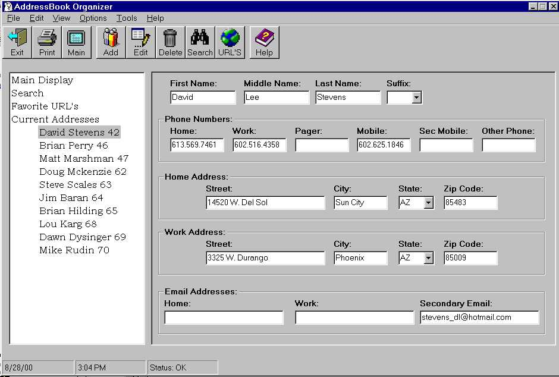



## BlackBook

### Description

This will store personal contacts, Favorite URLS, ect... It uses Icons in the menu, and has auto email. Uses the treeview control, and has some nice features. Still has some bugs, and the search page in not done yet. Must see, and vote.
 
### More Info
 

             |
---                |---
**Submitted On**   |2000-08-28 14:44:16
**By**             |[David Stevens](https://github.com/Planet-Source-Code/PSCIndex/blob/master/ByAuthor/david-stevens.md)
**Level**          |Intermediate
**User Rating**    |5.0 (20 globes from 4 users)
**Compatibility**  |VB 5\.0, VB 6\.0
**Category**       |[Complete Applications](https://github.com/Planet-Source-Code/PSCIndex/blob/master/ByCategory/complete-applications__1-27.md)
**World**          |[Visual Basic](https://github.com/Planet-Source-Code/PSCIndex/blob/master/ByWorld/visual-basic.md)
**Archive File**   |[CODE\_UPLOAD93868282000\.zip](https://github.com/Planet-Source-Code/david-stevens-blackbook__1-11065/archive/master.zip)

### API Declarations

Contained in the zip

